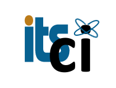

<h1>Agave with Python for Compute and Analysis Workshop</h1>
<h2>Date: April 19, 2018 9am-4:30pm</h2>
<h2>Location: Information Technology Center Room 105A/B, UH Manoa</h2>

<h3>Presenters: Rion Dooley (TACC), Sean Cleveland(UH), Ron Merrill (UH), David Schanzenbach (UH), and Jennifer Geis(UH)</h3>

This FREE workshop is sponsored by the University of Hawai'i Information Technology Service Cyberinfrastructure group, Texas Advanced Computing Center and Hawai'i EPSCoR.

This workshop focuses specifically on introducing the Agave platform (http://agaveapi.co), Cyverse (http://cyverse.org) and Python Agave tools that enable advanced compute, data management and analysis on distributed resources.

Attendees will learn about the latest trends in scientific computing and how to access some of these amazing resources,including the UH High Performance computing cluster, for their own research.  In addition attendees will learn how to leverage Agave with Python for managing their compute and data.  Along the way we will introduce other tools such as Docker and Jupyter notebooks that can help enable reproducible scientific analysis.

-- We will <b>NOT</b> be teaching Python skills in this workshop, this interactive primer covers the basics (<a href="https://campus.datacamp.com/courses/intro-to-python-for-data-science">Intro To Python</a>) --

## Takeaways:

### By the end of this workshop students will be able to:
* Have a basic understanding of Cyverse resources.
* Have a basic understanding of Docker and containers in relation to science.
* Launch Docker containers on their laptops.
* Create applications using Agave.
* Use Agave to launch computational jobs.
* Use Agave to manage data.
* Launch computation on the UH HPC.

## Requirements before the Workshop:
* Participants should have a basic understanding of Python - this interactive primer cover the basics (<a href="https://campus.datacamp.com/courses/intro-to-python-for-data-science">Intro to Python</a>)
* Participants should bring their laptops and plan to participate actively.
* Laptops will require a browser application for accessing Jupyter notebooks and Cyverse.  
* Docker will be required for running a special Jupyter notebook environment for the workshop - you can download and install Docker community edition for your specific operating system here (<a href="https://store.docker.com/search?type=edition&offering=community">Docker Download</a>)

## Registration:
<input type="button" onclick="location.href='https://docs.google.com/forms/d/e/1FAIpQLSe3sKhfUPb9T4OnUM7ZC-W-P5zdC5aj7_aqpmM1x9eHsXUArw/viewform?usp=sf_link';" value="REGISTER HERE" />

## Questions:
Please email seanbc@hawaii.edu with any questions concerning the workshop.
